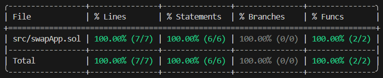

# Swap App
## Overview 🪙
An app for swapping stablecoins, in this case USDC -> DAI. Forking the Arbitrum network.
## Features 📃
* Swap your USDC for DAI
## Technical details ⚙️
* Interface for swapping tokens -> Uniswap v2 Contract Deployments.
* V2Router02 Contract Address -> 0x4752ba5dbc23f44d87826276bf6fd6b1c372ad24 (Arbitrum).
* Forked network for testing -> Arbitrum.
* RPC Server Address -> https://arb1.arbitrum.io/rpc.
* Framework CLI -> Foundry.
* Forge version -> 1.1.0-stable.
* Solidity compiler version -> 0.8.24.
## Deploying the contract 🛠️
1. Clone the GitHub repository.
2. Open Visual Studio Code (you should already have Foundry installed).
3. Select "File" > "Open Folder", select the cloned repository folder.
4. In the project navigation bar, open the "swapApp.t.sol" file located in the "test" folder.
5. On line 18 ("Address with USDC in Arbitrum Mainnet") enter the address of your wallet with USDC in the Arbitrum network. Note: Verify that you have at least 5 USDC on the Arbitrum network.
6. In the toolbar above, select "Terminal" > "New Terminal".
7. Select the "Git bash" terminal (previously installed).
10. Run the command `forge test -vvvv --fork-url https://arb1.arbitrum.io/rpc --match-test` followed by the name of a test function to test it and verify the smart contract functions are working correctly. For example, run `forge test -vvvv --fork-url https://arb1.arbitrum.io/rpc --match-test testHasBeenDeployedCorrectly` to test the `testHasBeenDeployedCorrectly` function.
11. Run `forge test -vvvv --fork-url https://arb1.arbitrum.io/rpc --match-test testSwapTokensCorrectly` to swap your 5 USDC for DAI. This is just a test on the forked Arbitrum network, so your USDC will remain in your wallet after this.
12. If you want to change the amount of USDC to swap, you will have to edit the amountIn variable in the testSwapTokensCorrectly() function.
13. Run `forge coverage --fork-url https://arb1.arbitrum.io/rpc` to generate a code coverage report, which allows you to verify which parts of the "NFTMarketpl.sol" script code (in the "src" folder) are executed by the tests. This helps identify areas outside the coverage that could be exposed to errors/vulnerabilities.
## Functions 📌
* `listNFT()` -> Puts an NFT up for sale using the parameters seller, nftaddress, tokenId, and price
* `cancelList()` -> Allows the owner of a listed NFT to cancel the sale of the NFT at any time.
* `buyNFT()` -> Allows any user to purchase the listed NFTs.
* `modifyFees()` -> The owner modifies the percentage of fees received for each NFT sale made in the Bazaar.
* `addToBlackList()` -> The owner can add any fraudulent user to a blacklist to prevent them from selling or buying NFTs within the bazaar.
* `removeFromBlacklist()` -> The owner can remove from the blacklist any user on it who has already been investigated and deserves to continue operating in the marketplace.
* `pausetransactions()` -> The owner can pause all transactions in the bazaar in case of emergency.
* `unpausetransactions()` -> The owner can resume all transactions in the bazaar when he considers that there are no longer risks to operate.
## Testing functions ⌨️
* `testMintNFT()` -> Verify that the NFT has been correctly minted to the user to perform the tests.
* `testShouldRevertIfPriceIsZero()` -> The test reverts if the price of the NFT to be listed is 0.
* `testShouldRevertIfNotOwner()` -> The test reverts if a user tries to list an NFT they do not own.
* `testListNFTCorrectly()` -> Verify that the user correctly lists the NFT.
* `testCancelListShouldRevertIfNotOwner()` -> The test reverts if a user tries to cancel the sale of an NFT they do not own.
* `testCancelListShouldWorkCorrectly()` -> Verifies that a user can successfully cancel a listed NFT they own.
* `testCanNotBuyUnlistedNFT()` -> The test should revert if you try to buy an NFT that is not listed by a user.
* `testCanNotBuyWithIncorrectPay()` -> The test reverts if a user attempts to purchase an NFT with an amount different from the price. It must be the exact same amount of Ether as the price of the NFT.
* `testShouldBuyNFTCorrectly()` -> Verify that any user can successfully purchase an NFT.
* `testOwnerCanModifyPercentFeesCorrectly()` -> Verify that the owner can correctly modify the fee percentage, which must be between 1 and 99%.
* `testOwnerCanAddToBlackListCorrectly()` -> Verify that the owner can add any user to the blacklist as long as that user is not already blocked.
* `testOwnerCanRemoveFromBlackListCorrectly()` -> Verify that the owner can remove any user from the blacklist while this user is there.
* `testOwnerCanPauseTheContract()` -> Verify that the owner can pause the bazaar contract as long as it is not already paused.
* `testOwnerCanUnpauseTheContract()` -> Verify that the owner can unpause the bazaar contract.
* `testUserCanNotListIfIsBlocked()` -> Verify that any blocked user cannot sell NFTs on the bazaar.
* `testUserCanNotCancelListIfIsBlocked()` -> Verify that any blocked user cannot delete NFTs for sale in the bazaar.
* `testUserCanNotBuyIfIsBlocked()` -> Ensure that any blocked user cannot purchase NFTs in the bazaar.
## Forge Coverage ✅
  

CODE IS LAW!
